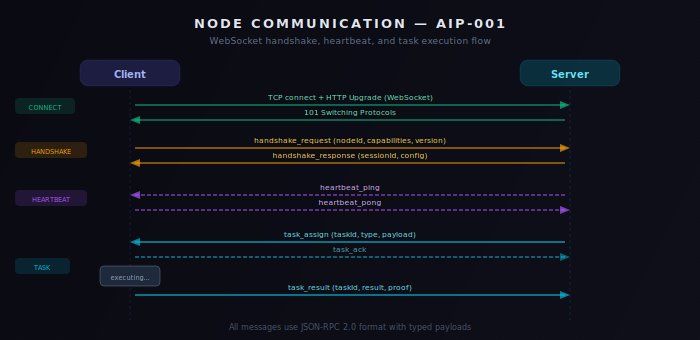

# AIP-001: Node Communication Protocol v2.0.0

| Field | Value |
|-------|-------|
| AIP | 001 |
| Title | Node Communication Protocol |
| Author | AgtOpen Core Team |
| Status | Final |
| Category | Network |
| Created | 2025-01-15 |
| Protocol Version | 2.0.0 |

## Abstract

This specification defines the Node Communication Protocol for connecting distributed compute resources to the AgtOpen Decentralized AI Network. The protocol establishes a persistent, bidirectional communication channel between compute nodes and the network coordinator using WebSocket as the primary transport with REST as a fallback mechanism. It covers connection establishment, capability negotiation, task assignment and execution, heartbeat monitoring, and fault-tolerant reconnection.

## Motivation

The AgtOpen network relies on a distributed pool of compute nodes to execute AI agent tasks including inference, data collection, and consensus validation. A standardized communication protocol is required to ensure interoperability between heterogeneous node implementations, provide reliable task delivery, and maintain network health visibility. Version 2.0.0 introduces structured capability negotiation, result integrity verification, and a formal reconnection strategy absent from the v1.x line.

## Specification

### 1. Transport

| Transport | Role | Endpoint |
|-----------|------|----------|
| WebSocket | Primary, persistent | `wss://nodes.agtopen.com/ws` |
| REST/HTTPS | Fallback, polling | `https://api.agtopen.com/v2/nodes` |

All connections MUST use TLS 1.2 or higher in production environments. Plaintext WebSocket (`ws://`) and HTTP are permitted only in local development with an explicit `ALLOW_INSECURE=true` environment flag.

### 2. Connection Flow



### 3. Message Types

All messages are JSON-encoded UTF-8 text frames with the following envelope:

```json
{
  "type": "<message_type>",
  "timestamp": "<ISO 8601>",
  "payload": { }
}
```

| Type | Direction | Description |
|------|-----------|-------------|
| `handshake_request` | Client -> Server | Node announces capabilities and requests admission |
| `handshake_response` | Server -> Client | Server confirms admission and provides configuration |
| `heartbeat_ping` | Server -> Client | Server liveness probe |
| `heartbeat_pong` | Client -> Server | Client liveness response |
| `task_assign` | Server -> Client | Server dispatches a task to the node |
| `task_ack` | Client -> Server | Node acknowledges task receipt |
| `task_result` | Client -> Server | Node returns completed task output |
| `task_reject` | Client -> Server | Node declines a task it cannot execute |
| `metrics_report` | Client -> Server | Node reports resource utilization metrics |
| `config_update` | Server -> Client | Server pushes updated configuration |
| `kick` | Server -> Client | Server forcibly disconnects the node |

### 4. Message Schemas

#### 4.1 `handshake_request`

```json
{
  "type": "handshake_request",
  "timestamp": "2025-06-01T12:00:00.000Z",
  "payload": {
    "token": "<JWT>",
    "protocolVersion": "2.0.0",
    "nodeVersion": "1.4.2",
    "capabilities": {
      "platform": "linux-x64",
      "cpu": {
        "cores": 8,
        "model": "AMD Ryzen 7 5800X"
      },
      "ram": {
        "totalMb": 32768
      },
      "gpu": {
        "model": "NVIDIA RTX 4090",
        "vramMb": 24576
      },
      "maxTasks": 4,
      "supportedTaskTypes": ["inference", "data_collection", "validation"]
    }
  }
}
```

| Field | Type | Required | Description |
|-------|------|----------|-------------|
| `token` | string | Yes | JWT bearer token for authentication |
| `protocolVersion` | string | Yes | Semantic version of this protocol the client implements |
| `nodeVersion` | string | Yes | Version of the node software |
| `capabilities.platform` | string | Yes | OS and architecture identifier |
| `capabilities.cpu.cores` | integer | Yes | Number of logical CPU cores |
| `capabilities.cpu.model` | string | No | CPU model name |
| `capabilities.ram.totalMb` | integer | Yes | Total RAM in megabytes |
| `capabilities.gpu.model` | string | No | GPU model name (omit if no GPU) |
| `capabilities.gpu.vramMb` | integer | No | GPU VRAM in megabytes |
| `capabilities.maxTasks` | integer | Yes | Maximum concurrent tasks this node can handle |
| `capabilities.supportedTaskTypes` | string[] | Yes | Task categories this node accepts |

#### 4.2 `handshake_response`

```json
{
  "type": "handshake_response",
  "timestamp": "2025-06-01T12:00:00.050Z",
  "payload": {
    "status": "accepted",
    "nodeId": "node_a1b2c3d4e5f6",
    "config": {
      "heartbeatIntervalMs": 30000,
      "heartbeatTimeoutMs": 10000,
      "maxMissedHeartbeats": 3,
      "taskAckTimeoutMs": 5000,
      "metricsIntervalMs": 60000
    }
  }
}
```

| Field | Type | Description |
|-------|------|-------------|
| `status` | `"accepted"` or `"rejected"` | Admission result |
| `nodeId` | string | Unique identifier assigned to this node session |
| `config` | object | Runtime configuration parameters |

If `status` is `"rejected"`, an additional `reason` string field is included and the server closes the WebSocket with code `4001`.

#### 4.3 `heartbeat_ping` / `heartbeat_pong`

```json
{
  "type": "heartbeat_ping",
  "timestamp": "2025-06-01T12:01:00.000Z",
  "payload": {
    "seq": 42
  }
}
```

```json
{
  "type": "heartbeat_pong",
  "timestamp": "2025-06-01T12:01:00.012Z",
  "payload": {
    "seq": 42,
    "load": {
      "cpuPercent": 45.2,
      "ramUsedMb": 12400,
      "gpuPercent": 78.0,
      "activeTasks": 2
    }
  }
}
```

The `seq` field MUST be echoed back unchanged. The `load` object is optional but recommended for scheduling optimization.

#### 4.4 `task_assign`

```json
{
  "type": "task_assign",
  "timestamp": "2025-06-01T12:02:00.000Z",
  "payload": {
    "taskId": "task_9f8e7d6c5b4a",
    "taskType": "inference",
    "priority": 5,
    "timeoutMs": 30000,
    "input": {
      "agentId": "agent_abc123",
      "prompt": "What is the current BTC/USDT price?",
      "parameters": {}
    }
  }
}
```

#### 4.5 `task_ack`

```json
{
  "type": "task_ack",
  "timestamp": "2025-06-01T12:02:00.100Z",
  "payload": {
    "taskId": "task_9f8e7d6c5b4a",
    "accepted": true
  }
}
```

The node MUST send `task_ack` within the configured `taskAckTimeoutMs` (default 5000ms). If the node cannot execute the task, it sets `accepted: false` and includes a `reason` string.

#### 4.6 `task_result`

```json
{
  "type": "task_result",
  "timestamp": "2025-06-01T12:02:02.500Z",
  "payload": {
    "taskId": "task_9f8e7d6c5b4a",
    "status": "completed",
    "result": {
      "answer": "BTC/USDT is currently trading at $67,432.50",
      "confidence": 0.95,
      "sources": ["binance", "coinbase"]
    },
    "resultHash": "a3f2b8c1",
    "executionMs": 2400
  }
}
```

| Field | Type | Description |
|-------|------|-------------|
| `status` | `"completed"` or `"failed"` | Execution outcome |
| `result` | object | Task output (arbitrary JSON) |
| `resultHash` | string | FNV-1a 32-bit hash of `JSON.stringify(result)` as hex |
| `executionMs` | integer | Wall-clock execution time in milliseconds |

#### 4.7 `task_reject`

```json
{
  "type": "task_reject",
  "timestamp": "2025-06-01T12:02:00.100Z",
  "payload": {
    "taskId": "task_9f8e7d6c5b4a",
    "reason": "unsupported_task_type"
  }
}
```

#### 4.8 `metrics_report`

```json
{
  "type": "metrics_report",
  "timestamp": "2025-06-01T12:03:00.000Z",
  "payload": {
    "nodeId": "node_a1b2c3d4e5f6",
    "uptime": 86400,
    "tasksCompleted": 142,
    "tasksFailed": 3,
    "avgExecutionMs": 1850,
    "load": {
      "cpuPercent": 52.1,
      "ramUsedMb": 14200,
      "gpuPercent": 65.3,
      "activeTasks": 2
    }
  }
}
```

#### 4.9 `config_update`

```json
{
  "type": "config_update",
  "timestamp": "2025-06-01T13:00:00.000Z",
  "payload": {
    "config": {
      "heartbeatIntervalMs": 20000,
      "maxTasks": 6
    }
  }
}
```

Only changed fields are included. The node MUST merge this with its existing configuration.

#### 4.10 `kick`

```json
{
  "type": "kick",
  "timestamp": "2025-06-01T14:00:00.000Z",
  "payload": {
    "reason": "protocol_violation",
    "reconnectAllowed": false
  }
}
```

After sending `kick`, the server closes the WebSocket with code `4003`. If `reconnectAllowed` is `true`, the client MAY attempt reconnection after a cooldown period.

### 5. Result Integrity

The `resultHash` field provides tamper detection for task results. The hash is computed using the FNV-1a 32-bit algorithm:

```
Input:  JSON.stringify(result)   // deterministic serialization
Output: lowercase hexadecimal    // e.g., "a3f2b8c1"
```

The server independently computes the hash upon receipt and compares it to the declared value. A mismatch results in the task being marked as corrupted and reassigned.

### 6. Heartbeat Protocol

1. The server sends `heartbeat_ping` every `heartbeatIntervalMs` (default 30,000ms).
2. The client MUST respond with `heartbeat_pong` within `heartbeatTimeoutMs` (default 10,000ms).
3. After `maxMissedHeartbeats` (default 3) consecutive missed pongs, the server considers the node dead, closes the connection with code `4002`, and reassigns all active tasks.

### 7. Reconnection Strategy

When the WebSocket connection drops unexpectedly, the client MUST implement exponential backoff:

| Attempt | Delay |
|---------|-------|
| 1 | 1s |
| 2 | 2s |
| 3 | 5s |
| 4 | 10s |
| 5 | 30s |
| 6-10 | 60s |

Maximum reconnection attempts: **10**. After 10 failed attempts, the node enters a dormant state and requires manual restart or a recovery signal.

On successful reconnection, the client sends a new `handshake_request`. The server MAY assign a new `nodeId` or restore the previous session if the JWT is still valid and the previous session has not been garbage-collected (default TTL: 5 minutes).

### 8. REST Fallback

When WebSocket connectivity is unavailable (e.g., restrictive firewalls), nodes MAY operate in polling mode using the REST API. This mode has higher latency and is not recommended for production workloads.

| Method | Endpoint | Description |
|--------|----------|-------------|
| `POST` | `/v2/nodes/register` | Register node and report capabilities |
| `POST` | `/v2/nodes/heartbeat` | Send heartbeat with load metrics |
| `GET` | `/v2/nodes/tasks` | Poll for assigned tasks |
| `POST` | `/v2/nodes/tasks/:id/ack` | Acknowledge task receipt |
| `POST` | `/v2/nodes/tasks/:id/complete` | Submit task result |
| `POST` | `/v2/nodes/tasks/:id/reject` | Reject a task |
| `POST` | `/v2/nodes/metrics` | Submit metrics report |

All REST endpoints require the `Authorization: Bearer <JWT>` header.

Polling interval MUST NOT be less than 5 seconds. The server MAY respond with `429 Too Many Requests` and a `Retry-After` header if the node polls too aggressively.

### 9. Security

- **Authentication**: JWT bearer tokens are required in the `handshake_request` (WebSocket) or `Authorization` header (REST). Tokens are issued by the AgtOpen Auth service and contain the node operator's identity and permissions.
- **Transport encryption**: TLS 1.2+ is mandatory in production. Certificate pinning is recommended for high-security deployments.
- **Rate limiting**: The server enforces per-node rate limits on message frequency (max 100 messages/second). Exceeding the limit results in a `kick` with `reason: "rate_limit_exceeded"`.
- **Input validation**: All message payloads are validated against JSON Schema before processing. Malformed messages are silently dropped with an increment to the node's violation counter. Five violations within 60 seconds trigger a `kick`.

### 10. Error Codes

| Code | Name | Description |
|------|------|-------------|
| `4000` | `bad_request` | Malformed message or invalid JSON |
| `4001` | `auth_failed` | JWT validation failed or expired |
| `4002` | `heartbeat_timeout` | Node failed to respond to heartbeat probes |
| `4003` | `kicked` | Node forcibly removed by server |
| `4004` | `protocol_mismatch` | Client protocol version is incompatible |
| `4005` | `rate_limited` | Message rate limit exceeded |
| `4006` | `duplicate_session` | Another session with the same credentials is already active |
| `4007` | `server_shutdown` | Server is shutting down gracefully |
| `4008` | `task_timeout` | Node failed to complete a task within the deadline |

### 11. Versioning

This protocol follows Semantic Versioning. The `protocolVersion` field in `handshake_request` allows the server to negotiate compatibility:

- **Major** version changes are breaking and require client updates.
- **Minor** version changes add new message types but remain backward-compatible.
- **Patch** version changes are bug fixes with no wire-format changes.

The server SHOULD support the current major version and one prior major version simultaneously.

## Backwards Compatibility

AIP-001 v2.0.0 is not backward-compatible with the v1.x protocol. Nodes running v1.x clients will receive a `handshake_response` with `status: "rejected"` and `reason: "protocol_mismatch"`. A migration guide is available in the AgtOpen documentation.

## Reference Implementation

See `packages/node-client/` for the TypeScript reference implementation of the node client, and `apps/coordinator/` for the server-side coordinator.
