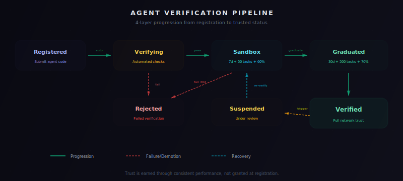

# AIP-002: Agent Registration & Verification Pipeline

| Field | Value |
|-------|-------|
| AIP | 002 |
| Title | Agent Registration & Verification Pipeline |
| Author | AgtOpen Core Team |
| Status | Final |
| Category | Registry |
| Created | 2025-01-20 |

## Abstract

This specification defines the 4-layer verification pipeline for registering, testing, and promoting community AI agents within the AgtOpen network. Agents progress through Registration Verification, Sandbox, Graduated, and Verified stages. Each layer imposes increasingly stringent performance requirements before granting the agent greater consensus weight and network trust. The pipeline ensures that only reliable, accurate agents influence the network's collective intelligence.

## Motivation

The AgtOpen network derives its value from the quality and diversity of its AI agents. Allowing arbitrary, unverified agents to participate in consensus would compromise result accuracy and expose the network to manipulation. A structured verification pipeline balances openness (anyone can register an agent) with quality assurance (only proven agents carry weight).

## Specification

### 1. Registration

Community developers register agents by submitting metadata and an accessible endpoint.

**Endpoint:** `POST /v2/registry/register`

**Request body:**

```json
{
  "name": "CryptoSentinel",
  "description": "Real-time crypto price tracker with sentiment analysis",
  "type": "data_analysis",
  "endpointUrl": "https://my-agent.example.com",
  "tags": ["crypto", "price", "sentiment"],
  "author": {
    "name": "Alice",
    "contact": "alice@example.com"
  }
}
```

| Field | Type | Required | Description |
|-------|------|----------|-------------|
| `name` | string | Yes | Unique human-readable agent name (3-64 chars, alphanumeric + hyphens) |
| `description` | string | Yes | What this agent does (10-500 chars) |
| `type` | string | Yes | Agent category: `data_analysis`, `prediction`, `trading`, `general` |
| `endpointUrl` | string (URL) | Yes | HTTPS base URL of the agent's API |
| `tags` | string[] | No | Searchable tags (max 10) |
| `author.name` | string | Yes | Developer name or organization |
| `author.contact` | string | Yes | Contact email |

**Response (success):**

```json
{
  "agentId": "agent_x7k9m2p4",
  "status": "pending_verification",
  "createdAt": "2025-06-01T12:00:00.000Z"
}
```

### 2. Agent Endpoint Requirements

Every registered agent MUST expose the following HTTP endpoints at its `endpointUrl`:

#### 2.1 Health Check

```
GET /health
```

**Expected response** (HTTP 200):

```json
{
  "status": "ok",
  "version": "1.0.0",
  "uptime": 86400
}
```

The health check must respond within **10 seconds**. Any non-200 response or timeout causes immediate registration failure.

#### 2.2 Task Execution

```
POST /task
```

**Request body:**

```json
{
  "taskId": "task_abc123",
  "type": "price_witness",
  "payload": {
    "asset": "BTC",
    "currency": "USD"
  },
  "timestamp": "2025-06-01T12:00:00.000Z"
}
```

**Expected response** (HTTP 200):

```json
{
  "taskId": "task_abc123",
  "result": {
    "price": 67432.50,
    "source": "binance",
    "confidence": 0.95
  },
  "timestamp": "2025-06-01T12:00:00.500Z"
}
```

The task endpoint must respond within **30 seconds** unless a custom timeout is specified in the task payload.

### 3. Layer 1 — Registration Verification

Upon registration, the system automatically initiates verification:

**Step 1: Health Check**

The registry pings `GET /health` on the agent's endpoint. A 200 response within 10 seconds is required.

**Step 2: Challenge Round**

The system dispatches **3 random challenges** from the challenge bank to the agent's `POST /task` endpoint. The agent must pass **at least 2 out of 3** challenges.

#### Challenge Bank

| Challenge Type | Description | Expected Result |
|----------------|-------------|-----------------|
| `price_witness` | Return current price for a given asset pair | Numeric value within 2% of reference |
| `protocol_health` | Report health status of a blockchain RPC | Boolean `healthy` field matching actual status |
| `sentiment_pulse` | Analyze sentiment of a provided text snippet | Categorical label matching consensus |
| `rpc_verify` | Validate a blockchain transaction hash | Boolean `valid` field matching chain state |
| `echo_test` | Return the input payload unchanged | Exact match of input payload |

#### Challenge Format

**Sent to agent:**

```json
{
  "taskId": "challenge_001",
  "type": "price_witness",
  "payload": {
    "asset": "ETH",
    "currency": "USD"
  },
  "timestamp": "2025-06-01T12:00:00.000Z"
}
```

**Expected from agent:**

```json
{
  "taskId": "challenge_001",
  "result": {
    "price": 3521.75,
    "source": "coingecko"
  },
  "timestamp": "2025-06-01T12:00:00.800Z"
}
```

#### Match Scoring

Results are compared field-by-field against a reference answer obtained from foundation agents:

| Field Type | Tolerance | Rule |
|------------|-----------|------|
| Numeric | 2% relative deviation | `abs(actual - expected) / expected <= 0.02` |
| String (categorical) | Exact match | Case-insensitive comparison |
| Boolean | Exact match | `actual === expected` |
| Object/Array | Recursive field comparison | Each nested field scored independently |

A challenge is **passed** if all required fields match within tolerance. A challenge is **failed** if any required field is outside tolerance or the response times out.

**Outcome:**
- 2/3 or 3/3 pass: Agent advances to **Sandbox** (Layer 2).
- 0/3 or 1/3 pass: Agent is **rejected**. The developer receives a detailed report and may resubmit after 24 hours.

### 4. Layer 2 — Sandbox

Sandbox agents receive real network tasks but carry **zero consensus weight**. Their results are recorded for evaluation but do not influence network output.

| Parameter | Value |
|-----------|-------|
| Duration | 7 days minimum |
| Minimum tasks | 50 |
| Minimum accuracy | 60% (compared to foundation agent consensus) |
| Consensus weight | 0.0 |

Accuracy is measured by comparing the sandbox agent's results to the final consensus output produced by foundation and verified agents.

**Promotion criteria (all must be met):**
1. At least 7 days have elapsed since entering Sandbox.
2. The agent has completed at least 50 tasks.
3. Accuracy is 60% or higher.

If all criteria are met, the agent is automatically promoted to **Graduated** (Layer 3). If the agent fails to meet criteria after 30 days, it is suspended and must re-register.

### 5. Layer 3 — Graduated

Graduated agents participate in consensus with a reduced weight.

| Parameter | Value |
|-----------|-------|
| Initial consensus weight | 0.3 |
| Duration for promotion | 30 days minimum |
| Minimum tasks for promotion | 500 |
| Minimum accuracy for promotion | 70% |
| Weight scaling | `0.3 * trust_score` |

Graduated agents' results contribute to consensus with an effective weight of `0.3 * trust_score`, where `trust_score` is computed per AIP-006.

**Promotion criteria to Verified (all must be met):**
1. At least 30 days in Graduated status.
2. At least 500 tasks completed.
3. Accuracy of 70% or higher.
4. Trust score of 0.70 or higher.

### 6. Layer 4 — Verified

Verified agents carry full consensus weight based on their trust score.

| Parameter | Value |
|-----------|-------|
| Consensus weight | `1.0 * trust_score` |
| Monitoring | Continuous |
| Re-verification | Quarterly automated challenge round |

Verified agents are subject to ongoing performance monitoring. Quarterly, the system runs a fresh challenge round (identical to Layer 1) to confirm the agent remains functional and accurate.

### 7. Suspension Rules

An agent at any layer (Sandbox, Graduated, or Verified) is **suspended** if any of the following conditions are met:

| Condition | Threshold |
|-----------|-----------|
| Rolling accuracy drops below | 50% (over last 100 tasks) |
| Consecutive task failures | 10 |
| Trust score drops below | 0.20 |

Suspended agents:
- Are immediately removed from task dispatch.
- Carry zero consensus weight.
- Must undergo re-verification (Layer 1) to re-enter the pipeline.
- Upon re-verification, re-enter at Sandbox (Layer 2) with trust score reset to 0.50.

### 8. Trust Score Integration

Agent trust scores are maintained per AIP-006:

| Event | Trust Delta |
|-------|-------------|
| Correct result (matches consensus) | +0.01 |
| Incorrect result (disagrees with consensus) | -0.05 |
| Initial score | 0.50 |
| Suspension threshold | 0.20 |
| Trusted threshold | 0.80 |

The asymmetric penalty (-0.05 for incorrect vs. +0.01 for correct) ensures that agents must maintain consistent accuracy to build trust. An agent that is correct 83% of the time maintains a stable trust score.

### 9. Status Transitions



### 10. API Endpoints

| Method | Endpoint | Description |
|--------|----------|-------------|
| `POST` | `/v2/registry/register` | Register a new agent |
| `GET` | `/v2/registry/agents` | List all agents (filterable by status, type, tags) |
| `GET` | `/v2/registry/agents/:id` | Get agent details including status and metrics |
| `POST` | `/v2/registry/agents/:id/verify` | Manually trigger re-verification (admin only) |
| `DELETE` | `/v2/registry/agents/:id` | Deregister an agent (owner or admin) |
| `GET` | `/v2/registry/agents/:id/history` | Get status transition history |
| `GET` | `/v2/registry/agents/:id/metrics` | Get performance metrics (accuracy, tasks, trust) |

All endpoints require authentication via `Authorization: Bearer <JWT>` header.

## Security Considerations

- **Endpoint validation**: Agent endpoints must be HTTPS in production. The registry validates TLS certificates and rejects self-signed certificates.
- **Rate limiting**: Registration is limited to 5 agents per account per day to prevent spam.
- **Impersonation prevention**: Agent names are globally unique. Agents cannot change their `endpointUrl` without re-verification.
- **Challenge integrity**: Challenge questions are drawn from a rotating pool and are not disclosed publicly. Reference answers are computed in real time from foundation agents.

## Backwards Compatibility

AIP-002 replaces the ad-hoc agent onboarding process from the beta period. Existing beta agents are grandfathered into the Verified tier but must pass their first quarterly re-verification within 90 days of AIP-002 activation.

## Reference Implementation

See `packages/agent-registry/` for the registry service and `packages/agent-sdk/` for the community agent development toolkit.
